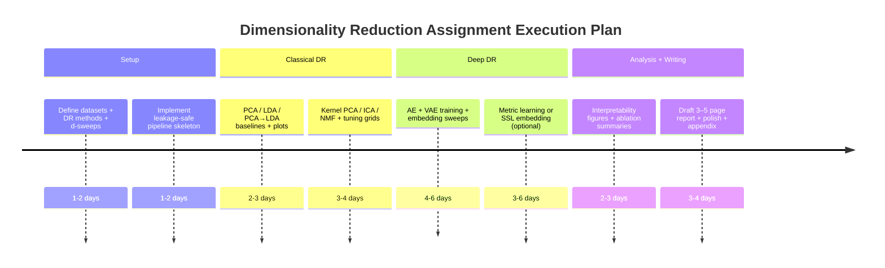

# Survey-Grounded Dimensionality Reduction Review and a High-Probability Full-Marks Experimental Plan

## Executive Summary

Dimensionality reduction (DR) improves classification when it removes nuisance variation, reduces estimator variance (especially in “high-D, low-N” regimes), and produces features more aligned with class structure, but it can also hurt when it discards discriminative information or introduces mapping/overfitting artifacts. These tradeoffs—and how to operationalize them—are repeatedly emphasized across influential surveys in reputable venues such as **Foundations and Trends in Machine Learning**, **JMLR**, and multiple **IEEE** journals. citeturn17search4turn0search0turn14search1turn12search23

For the assignment, the most reliable way to earn full marks is to (i) choose datasets that clearly exhibit the curse of dimensionality + low intrinsic structure (so the accuracy-vs-d curve is informative), (ii) compare **both supervised and unsupervised** DR families (linear + nonlinear + deep), (iii) enforce **no leakage** via strict train-only fitting and nested model selection, and (iv) provide interpretable analyses beyond the curve (explained variance, basis visualization, reconstruction error patterns, and class separation metrics). citeturn17search4turn16search0turn18search8turn14search3

## Influential Surveys on Classical Dimensionality Reduction

A small set of survey/tutorial papers repeatedly serves as the “spine” of DR literature summaries because they (a) unify many classical methods under common geometry/probability views, and (b) provide practical guidance around out-of-sample mapping, kernelization, and manifold assumptions.

**Christopher J. C. Burges — “Dimension Reduction: A Guided Tour.” (FnT ML, 2010)**  
This tutorial explicitly organizes DR into **projective methods** (e.g., PCA, ICA, kernel PCA, probabilistic PCA, CCA, Fisher/LDA variants, sufficient dimension reduction) versus **manifold modeling** (MDS, Isomap, LLE, graphical/spectral methods), and it highlights the importance of choosing DR by the *data-generating structure* (linear subspace vs nonlinear manifold) and the need to preserve properties required by the downstream task (e.g., distances for kNN). It is influential both as a pedagogical reference and as a broad “method map,” and it is widely cited (citation counts depend on index; the publisher-hosted PDF is marked “cited by 426” in the search index snapshot). citeturn17search4

**John P. Cunningham & Zoubin Ghahramani — “Linear Dimensionality Reduction: Survey, Insights, and Generalizations.” (JMLR, 2015)**  
This survey is influential because it provides a unified linear-algebra + probabilistic perspective on **linear** DR, bridging classical techniques (PCA, factor-analysis-like models, supervised linear projections, latent variable models) and clarifying when “linear DR” is not merely a heuristic but a statistically meaningful estimator. The JMLR page reports the paper is highly cited (shown as “Cited by 879” in the official JMLR listing). citeturn0search0  
A particularly assignment-relevant takeaway is that *linear DR* often provides strong baselines and diagnostic value: if linear methods already saturate performance, nonlinear/deep DR should justify its added complexity with clear gains or interpretability. citeturn0search0turn17search4

**Xudong Jiang — “Linear Subspace Learning-Based Dimensionality Reduction.” (SPM, 2011)**  
This tutorial-style article surveys linear subspace learning for DR in pattern recognition/classification contexts, addressing objectives such as retaining discriminative information and improving generalization. A Semantic Scholar snapshot reports “156 citations,” indicating sustained uptake as a linear DR reference. citeturn16search0  
For an assignment focused on classification accuracy vs dimensionality, its key message is that *the “best” subspace depends on the classification criterion*, not only on reconstruction variance (PCA). citeturn16search0

**Ulrike von Luxburg — “A Tutorial on Spectral Clustering.” (Statistics and Computing, 2007)**  
Although framed as clustering, this tutorial is central to **spectral** DR intuition: eigenvectors of graph Laplacians define embeddings that can linearize complex structure. Its exceptional citation volume (Springer page shows “Cited by 14652”) makes it one of the most influential spectral-method tutorials in ML. citeturn0search11  
For your report, the essential bridge is: spectral methods provide embeddings that often separate classes when Euclidean geometry is misleading—at the cost of hyperparameters (graph construction, neighborhood scales) and computational overhead. citeturn0search11turn17search4

**Ronen Talmon, Israel Cohen, Sharon Gannot, Ronald R. Coifman — “Diffusion Maps for Signal Processing: A Deeper Look at Manifold-Learning Techniques Based on Kernels and Graphs.” (SPM, 2013)**  
This survey reviews manifold learning based on **kernels/graphs** and focuses on diffusion maps as a nonlinear DR tool; it also emphasizes difficulties integrating geometric methods into real pipelines due to measurement noise and dependence on the sampling/instrument. A hosted PDF snapshot is marked “Cited by 105” (index-dependent). citeturn18search8  
For the assignment, its most actionable point is that manifold DR introduces **nontrivial tunables** (kernel bandwidth, graph connectivity) and you must show stability and non-leakage when selecting them. citeturn18search8

**Dalton Lunga, Saurabh Prasad, Melba M. Crawford, Okan K. Ersoy — “Manifold-Learning-Based Feature Extraction for Classification of Hyperspectral Data: A Review of Advances in Manifold Learning.” (SPM, 2014)**  
This review is influential in emphasizing a classification-first view of manifold learning: hyperspectral data are high-dimensional with nonlinear structure, but performance depends strongly on the dataset and parameters. A Semantic Scholar snapshot reports “288 citations,” indicating strong uptake in remote sensing + ML feature extraction contexts. citeturn7search2  
In your assignment narrative, this supports the idea that nonlinear DR can help but can also be brittle, so you should quantify sensitivity and computational cost (time/memory) alongside accuracy. citeturn7search2turn18search8

**Aapo Hyvärinen & Erkki Oja — “Independent Component Analysis: Algorithms and Applications.” (Neural Networks, 2000)**  
This classic review gives ICA’s core assumptions (statistical independence, non-Gaussianity), algorithms, and applications; ScienceDirect’s index snapshot shows very high citation counts (“Cited by 13312”), consistent with its foundational role. citeturn3search1turn3search33  
In an assignment context, ICA is useful as a contrast to PCA: it targets *independent latent sources* rather than maximum variance, and can produce different behavior in accuracy-vs-d curves—particularly when the signal is more “source-like” than “variance-like.” citeturn3search1turn17search4

**Yu-Xiong Wang & Yujin Zhang — “Nonnegative Matrix Factorization: A Comprehensive Review.” (TKDE, 2013)**  
This survey is influential because it systematizes NMF models/constraints/algorithms and frames NMF as DR with **nonnegativity** yielding more interpretable “parts-based” representations. The ACM-hosted entry reports “Cited by 1304,” demonstrating strong impact. citeturn19search2turn19search8  
For the assignment, NMF is highly suitable when inputs are nonnegative (images, counts) and you want interpretability via basis visualization; it also forces you to handle preprocessing carefully, since mean-centering breaks nonnegativity. citeturn19search8turn17search4

## Influential Surveys on Deep Representation and Embedding Methods

Deep DR and embedding methods are often best understood as *learning a parameterized map* \(f_\theta(x)\in\mathbb{R}^d\) with objectives tied to reconstruction, generative modeling, or relational similarity. The surveys below are influential because they explain objectives and evaluation protocols that prevent misleading “wins.”

**Yoshua Bengio, Aaron C. Courville, Pascal Vincent — “Representation Learning: A Review and New Perspectives.” (TPAMI, 2013)**  
This is a canonical review tying together unsupervised feature learning, deep networks, autoencoders, and manifold perspectives; the ACM-hosted entry reports “Cited by 19656,” reflecting major influence. citeturn14search1turn14search3  
Assignment-relevant framing: DR is not only a linear algebra trick; it is *part of representation learning*, and the “right” features depend on invariances and factors of variation, which deep methods can capture when linear projections cannot. citeturn14search3turn17search4

**Diederik P. Kingma & Max Welling — “An Introduction to Variational Autoencoders.” (FnT ML, 2019)**  
This tutorial-level survey is influential for VAEs as **principled latent-variable DR** with amortized inference. Google Research lists it as “Cited by 4584,” indicating broad adoption. citeturn13search19turn13search2  
For your assignment: VAEs provide learned \(d\)-dimensional latent variables with probabilistic regularization (KL to a prior), often yielding smoother embeddings than plain autoencoders, but they require careful choice of reconstruction model and regularization strength, otherwise the latent space can underutilize dimensions (“posterior collapse” phenomena are widely discussed in VAE literature). citeturn13search19

**Longlong Jing & Yingli Tian — “Self-Supervised Visual Feature Learning With Deep Neural Networks: A Survey.” (TPAMI, 2021)**  
This survey is influential as a broad map of self-supervised objectives (pretext tasks and contrastive approaches) and evaluation protocols for learned embeddings; Semantic Scholar’s snapshot reports “1,919 citations,” reflecting strong impact. citeturn12search0turn12search2  
For the assignment: self-supervised embeddings can be treated as DR features learned without labels, after which you attach a simple classifier (linear probe or kNN). The key is to keep the self-supervised training strictly on training data only. citeturn12search0

**Jiajun Gui and collaborators — “A Survey on Self-Supervised Learning: Algorithms, Applications, and Future Trends.” (TPAMI, 2024)**  
This more recent TPAMI survey (Computer Society entry shows “Cited by 664” in the snapshot) synthesizes SSL across broader modalities and highlights how objective design (contrastive/generative/predictive) influences representation quality and downstream transfer. citeturn12search23  
Assignment relevance: it motivates reporting not only accuracy but also *stability across random seeds* and *the evaluation protocol (linear probe vs kNN vs finetuning)* because SSL results are especially protocol-sensitive. citeturn12search23turn12search0

**Jiwen Lu, Junlin Hu, Jie Zhou — “Deep Metric Learning for Visual Understanding: An Overview of Recent Advances.” (SPM, 2017)**  
This invited overview explains deep metric objectives (contrastive, triplet, ranking losses), sampling/mining, and how deep embeddings are evaluated via nearest-neighbor retrieval or classification in embedding space. The NTU repository snapshot shows “Cited by 183.” citeturn6search4turn6search27  
For your assignment, it provides a clean way to make “deep embedding dim \(d\)” directly comparable to classical DR dims: you sweep the embedding dimension and evaluate a fixed classifier (e.g., 1-NN) in the embedding space. citeturn6search4

## Practitioner Recommendations Synthesized Across Surveys

Across the surveys above, several consistent practitioner recommendations emerge; these can be turned into concrete “why we chose method X” justifications in a 3–5 page report.

**Choose DR by the structure you believe exists and the guarantees you need.**  
If a linear subspace is a reasonable approximation, linear methods (PCA/LDA variants) are strong baselines and often competitive, especially when you need an explicit out-of-sample linear map and interpretability. citeturn0search0turn16search0turn17search4  
If the data lie on a curved manifold with meaningful neighborhood relations, graph/kernel manifold methods (diffusion maps, Isomap/LLE families, spectral embeddings) can linearize structure but introduce sensitivity to neighborhood/bandwidth hyperparameters and scaling costs. citeturn18search8turn0search11turn17search4

**Supervision changes the geometry: LDA-like objectives can dominate when labels are reliable—and can saturate at \(d\le C-1\).**  
This is ideal for your assignment because it produces a characteristic curve shape: accuracy often rises sharply up to \(C-1\) and plateaus; reporting this constraint explicitly demonstrates conceptual mastery. citeturn17search4turn16search0

**Interpretability-driven DR is a legitimate axis.**  
NMF is repeatedly justified when nonnegativity is natural and “parts-based” bases are interpretable; ICA is justified when independence is a plausible latent assumption. Showing basis visualizations (NMF components, ICA sources, PCA eigenvectors) directly supports analysis beyond a single curve. citeturn19search8turn3search1turn17search4

**Deep DR/embeddings become compelling when invariances and nonlinear factors matter, but evaluation protocol must be disciplined.**  
Autoencoders/VAEs are DR via reconstruction/generative objectives; metric learning and self-supervised embeddings are DR via similarity/contrastive objectives. For full marks, you must explain what supervision is used (none vs labels) and how you avoid leakage, because deep methods have more degrees of freedom and can overfit silently. citeturn14search3turn13search19turn12search23turn6search4

## Full-Marks Experimental Plan for the Assignment

### Dataset selections

The plan uses **two public, high-dimensional image datasets** that yield clean and interpretable accuracy-vs-\(d\) curves, while keeping compute manageable.

image_group{"layout":"carousel","aspect_ratio":"1:1","query":["Fashion-MNIST sample images grid","Olivetti faces dataset sample images"],"num_per_query":1}

**Dataset A: Fashion-MNIST (grayscale clothing images)**  
Officially introduced as a drop-in replacement for MNIST; contains 70,000 images, 10 classes, 28×28 grayscale. citeturn20search0turn15search0  
- **N**: 70,000 total; 60,000 train / 10,000 test. citeturn20search0turn15search0  
- **D**: 784 (flattened 28×28). citeturn20search0  
- **C**: 10 classes. citeturn20search0turn15search0  
- **Class balance**: 7,000 images per category overall (paper); common usage further treats this as 6,000 train + 1,000 test per class. citeturn20search0turn20search7  
- **Why chosen**: (i) high-D but structured; (ii) perfect for PCA/NMF basis visualization; (iii) supports deep DR (AE/VAE, contrastive) at reasonable scale. citeturn20search0turn19search8turn13search19

**Dataset B: Olivetti Faces (face identity classification)**  
A classic high-D low-N dataset: 400 images of 40 subjects, 64×64 grayscale, typically used to study subspace methods and regularization. citeturn15search1turn15search5  
- **N**: 400 total. citeturn15search1turn15search5  
- **D**: 4096 (flattened 64×64). citeturn15search1  
- **C**: 40 classes. citeturn15search1turn15search5  
- **Class balance**: 10 images per subject (uniform). citeturn15search5  
- **Why chosen**: (i) highlights “high-D low-N” instability where DR often helps; (ii) LDA’s \(C-1=39\) limit is clearly visible; (iii) excellent for eigenface/Fisherface style analysis. citeturn15search1turn17search4turn16search0

Dataset URLs to cite in your report (official sources):
```text
Fashion-MNIST official repository: https://github.com/zalandoresearch/fashion-mnist
Fashion-MNIST paper (arXiv): https://arxiv.org/abs/1708.07747
Olivetti faces dataset (sklearn fetch_olivetti_faces docs): https://scikit-learn.org/stable/modules/generated/sklearn.datasets.fetch_olivetti_faces.html
Olivetti faces dataset description: https://scikit-learn.org/stable/datasets/real_world.html
```
(These URLs correspond to the dataset facts summarized above.) citeturn15search0turn20search0turn15search1turn15search5

### Dimensionality-reduction methods to implement/evaluate

The assignment only requires “PCA, LDA or both or others,” but to maximize marks you can evaluate a diverse set spanning the families cited in surveys: linear, kernel/manifold, matrix factorization, ICA, and deep embeddings. citeturn17search4turn19search8turn3search1turn13search19turn12search23

Below is an implementation-ready set (≥6), with clear hyperparameters and sweepable embedding dimension \(d\).

**Core DR set (recommended as mandatory in your experiments)**  
1) **PCA** (unsupervised linear) — baseline for variance-preserving DR. citeturn17search4turn0search0  
2) **LDA** (supervised linear; max dim \(C-1\)) — discriminative DR baseline. citeturn17search4turn16search0  
3) **PCA → LDA** (“Fisherfaces”-style two-stage) — stabilizes LDA in high-D low-N settings by first reducing noise/degeneracy. citeturn17search4turn16search0  
4) **Kernel PCA (RBF)** — kernel method baseline capturing nonlinear structure. citeturn17search4turn18search8  
5) **NMF** — parts-based DR for nonnegative images. citeturn19search8  
6) **ICA (FastICA)** — independence-seeking DR alternative to variance-based PCA. citeturn3search1  

**Deep DR/embedding set (recommended as “advanced extension,” but still aligned with survey best practices)**  
7) **Undercomplete Autoencoder (AE)** — nonlinear DR via reconstruction. citeturn14search3  
8) **VAE / β-VAE** — probabilistic latent DR; sweep latent dimension \(d\). citeturn13search19  
9) **Deep Metric Learning embedding** (triplet/contrastive loss) — supervised embedding DR; evaluate via kNN or nearest-centroid in embedding space. citeturn6search4  
10) **Self-supervised contrastive embedding** (SimCLR-style) — unsupervised embedding DR; evaluate via linear probe/kNN. citeturn12search23turn12search0  

**Visualization-only (explicitly not used for the accuracy-vs-\(d\) curve)**  
- **t-SNE / UMAP**: excellent for qualitative 2D plots but not ideal for your assignment’s “classification vs dimensionality” curve because mapping/transform and hyperparameter dependence can make fair test-time evaluation tricky. (Use them to *explain* results, not to claim improvements.) citeturn0search11turn18search8

### Hyperparameters, training protocol, and strict no-leakage steps

The single most important “full marks” risk is **data leakage** (fitting normalization/DR on test data, or using test accuracy to pick hyperparameters). Your report should state explicit steps.

**Global split protocol**  
- **Fashion-MNIST**: use the standard 60k/10k split as the held-out test set. citeturn20search0turn15search0  
- **Olivetti**: use **stratified** split per person, e.g., 5 train + 5 test images per subject; repeat for multiple random seeds to obtain mean±std. citeturn15search5turn0search0  

**Nested selection protocol (train-only tuning)**  
For each dataset and each DR method:
1. Split training data into **train-train** and **val** folds (e.g., 5-fold stratified CV).  
2. For each candidate dimensionality \(d\) and each hyperparameter setting (method-specific), fit preprocessing + DR + classifier on train-train only.  
3. Select hyperparameters **only** by CV mean accuracy on val folds.  
4. Refit preprocessing + DR + classifier on *full training set* using chosen hyperparameters for that \(d\).  
5. Evaluate once on test set to obtain the point on the curve.

This protocol mirrors the caution in multiple surveys that nonlinear/kernel/manifold and deep embeddings are sensitive to tunables and can overfit if you implicitly tune on test. citeturn18search8turn7search2turn12search23

**Method-specific hyperparameters you should tune (minimal but defensible grids)**

- **PCA**: whitening {off,on}; solver is fixed by library. Also consider “retain X% variance” as a secondary analysis, but the main sweep is explicit \(d\). citeturn0search0turn17search4  
- **LDA**: covariance regularization / shrinkage (e.g., {none, automatic shrinkage}); solver choice if available. Explicitly report \(d\le C-1\). citeturn0search0turn16search0  
- **PCA→LDA**: PCA pre-dim \(m\) grid (e.g., \(m\in\{50,100,200\}\) for Fashion; \(m\in\{50,100,200,300\}\) for Olivetti), then LDA dims \(d\le C-1\). Motivation: LDA can be ill-posed in high-D low-N; two-stage schemes help. citeturn17search4turn15search1  
- **Kernel PCA (RBF)**: bandwidth \(\gamma\in\{10^{-4},10^{-3},10^{-2},10^{-1},1\}\) (scale per dataset), regularization \(\alpha\in\{10^{-6},10^{-4},10^{-2}\}\), neighbors not needed (kernel-based). citeturn17search4turn18search8  
- **NMF**: rank \(d\), init {nndsvd, random}, solver {cd, mu}, max_iter, and sparsity/regularization if you want an “advanced” lever. Stress nonnegativity preprocessing. citeturn19search8  
- **ICA**: number components \(d\), nonlinearity {logcosh, exp}, max_iter, tolerance; report instability if it occurs (that itself is a valid finding). citeturn3search1  
- **AE**: architecture depth/width (keep fixed across \(d\) except bottleneck), optimizer/lr, weight decay, dropout, early stopping on val reconstruction loss; optionally add denoising corruption (small Gaussian noise or masking) as a robustness variant. citeturn14search3  
- **VAE / β-VAE**: β \(\in\{0.5,1,2,4\}\), lr, decoder likelihood (Bernoulli for [0,1] pixels is common), early stopping on val ELBO; sweep latent dim \(d\). citeturn13search19  
- **Deep metric learning**: loss {contrastive, triplet}, margin \(m\), mining strategy (semi-hard vs batch-hard), batch composition (P classes × K instances). Sweep embedding dim \(d\). citeturn6search4  
- **Self-supervised contrastive**: temperature τ, augmentation strength, batch size, projection head size; sweep embedding dim \(d\). Evaluate with a fixed linear probe. citeturn12search23turn12search0  

### Classifiers and how they connect to DR outputs

To align with the assignment’s recommendation, keep at least one **distance-based** classifier and one **linear** classifier, both operating on the reduced features \(z\in\mathbb{R}^d\). citeturn17search4

Recommended classifier suite:
- **1-NN (Euclidean)**: very sensitive to geometry changes induced by DR, so it makes your curve highly diagnostic. citeturn17search4  
- **Minimum Mahalanobis distance to class mean**: implement with **regularized/shrinkage covariance** (or diagonal covariance) in the reduced space to avoid singularity, especially on Olivetti. citeturn15search1turn0search0  
- **Logistic regression / linear SVM**: robust linear baselines in reduced space; often shows smoother curves and helps interpret whether DR creates linear separability. citeturn0search0turn16search0  

Mapping is always:
1. Fit DR mapping on training set: \(x\mapsto z=f(x)\).  
2. Fit classifier on \((z_{\text{train}}, y_{\text{train}})\).  
3. Evaluate on \(z_{\text{test}}=f(x_{\text{test}})\).  
This is exactly the “DR → classification” pipeline emphasized in both classical and deep representation surveys. citeturn17search4turn14search3

### Evaluation metrics, statistics, and plotting requirements

**Primary metrics**  
- Accuracy and error rate \(=1-\text{accuracy}\) vs \(d\). (This is exactly what the assignment asks you to plot.)  

**Robustness reporting**  
- Report **mean ± std** across repeated splits/seeds:  
  - Fashion-MNIST: 3–5 random seeds (or repeated subsampling if compute-bound).  
  - Olivetti: ≥10 random splits because N is small and variance is high. citeturn15search5turn7search2  

**Statistical tests (to strengthen the “analysis” section)**  
- Use a paired test on per-split accuracies comparing methods at fixed \(d\):  
  - Paired t-test if approximately normal, or Wilcoxon signed-rank otherwise.  
This is over-and-above the minimum assignment requirements, but it often differentiates “good” from “excellent” reports. citeturn7search2turn12search23  

**Plot requirements (minimum + “full marks” enhancements)**  
- Minimum: one curve per method: accuracy vs \(d\).  
- Enhancements:
  - Shaded band for ±1 std over repeats.  
  - Vertical line at \(C-1\) for LDA limit (9 for Fashion, 39 for Olivetti). citeturn15search1turn20search0  
  - Optionally add “area under curve” (AUC over \(d\)) summary in a table.

### Interpretability and visualization techniques to explain results

To score full marks on “analysis,” you want figures that directly tie to method assumptions.

- **PCA eigenvectors (“eigenimages”)**: reshape top components into 28×28 (Fashion) or 64×64 (Olivetti) and discuss what variation they capture (stroke/edges vs illumination). citeturn0search0turn17search4  
- **Explained variance ratio vs component index**: show how quickly variance concentrates; connect plateaus to diminishing returns in accuracy. citeturn0search0turn17search4  
- **NMF parts visualization**: show learned basis images to argue interpretability and localized features. citeturn19search8  
- **AE/VAE reconstructions**: random reconstructions + worst-case reconstructions per class; add **class-conditional reconstruction error maps** (mean absolute error image) to discuss what information is lost as \(d\) shrinks. citeturn13search19turn14search3  
- **Embedding scatter plots** (2D via PCA or visualization-only UMAP/t-SNE) on learned features: show class separation qualitatively; clarify that these are for explanation, not for performance claims. citeturn18search8turn0search11  
- **Class separation metrics**: e.g., ratio of between-class scatter to within-class scatter in the reduced space (especially meaningful when discussing LDA). citeturn16search0turn0search0  
- **Mahalanobis distance spectrum / covariance conditioning**: report eigenvalues/condition number of pooled covariance in the reduced space to explain why Mahalanobis may degrade at high \(d\) without shrinkage. citeturn15search1turn0search0  
- **Confusion matrices at selected \(d\)** (e.g., \(d\in\{2,16,64\}\)): show which classes benefit most from DR. (Pick only a few to fit in 3–5 pages.)

## Reproducible Pipeline and Report Outline

### Reproducible experiment pipeline

A “mini-program” that is easy to audit should be deterministic and modular:

1. **Config**: dataset name, seed list, split protocol, DR method list, \(d\)-grid per dataset, classifier list, hyperparameter grids.  
2. **Data**: load → train/test split (or use official split) → optional subsampling (document it). citeturn20search0turn15search1  
3. **Preprocess** (train-only fit):  
   - Standardization for PCA/LDA/ICA/kPCA (mean 0, variance 1)  
   - MinMax [0,1] for NMF and Bernoulli-decoder VAE  
4. **Fit DR** on training only; transform train and test.  
5. **Fit classifier** on reduced train features; evaluate on reduced test features.  
6. **Repeat** for all \(d\), all seeds; save results to a single long-form CSV/JSON for plotting.  
7. **Plot** curves and produce tables; export figures to include in the PDF report.  

Suggested \(d\)-grids (explicitly list them in the report):
- Fashion-MNIST (D=784): \(d\in\{2,4,8,16,32,64,128,256\}\), plus \(d=512\) if budget allows; for LDA constrain to \(d\in\{1,\dots,9\}\). citeturn20search0  
- Olivetti (D=4096): \(d\in\{2,5,10,20,30,39,60,80,100,150,200\}\); include \(d=39\) explicitly to match LDA max. citeturn15search1turn15search5  

### Mermaid timeline for executing before the deadline



### Report outline that fits 3–5 pages while looking “full marks”

A tight structure that still signals rigor:

- **Introduction**: why DR can help classification; what you will test; brief connection to survey taxonomy (linear vs nonlinear vs deep). citeturn17search4turn14search3  
- **Datasets and preprocessing**: N, D, C, class balance, splits, and normalization (explicitly note NMF nonnegativity). citeturn20search0turn15search1turn19search8  
- **Methods**: DR methods (grouped by family), classifiers, and hyperparameter tuning protocol; explicitly state no-leakage mechanics. citeturn18search8turn12search23turn0search0  
- **Results**:  
  - Accuracy vs \(d\) curves (one per dataset; multiple methods overlaid).  
  - Small table: best accuracy and the argmax \(d\) per method (chosen without using test data for tuning).  
  - Runtime/memory notes for heavier methods (kernel/deep). citeturn7search2turn18search8  
- **Analysis and discussion**: explain curve shapes using interpretability figures (eigenimages, NMF parts, recon errors), LDA max-d constraint, and bias–variance intuition; comment on stability across seeds; optionally include a statistical significance table. citeturn0search0turn15search1turn13search19  
- **Conclusion**: concise takeaways on “when to use which family,” grounded in what you observed and consistent with survey insights. citeturn17search4turn12search23turn19search8  
- **References**: cite the surveys and dataset pages.  
- **Appendix**: full code listing (as required).

If you include **two** datasets and **8–10** DR methods, keep the main text readable by showing (i) two main curves (one per dataset) and (ii) a compact “best results table,” while moving extra ablations (e.g., more classifiers) to an appendix figure page if allowed.

